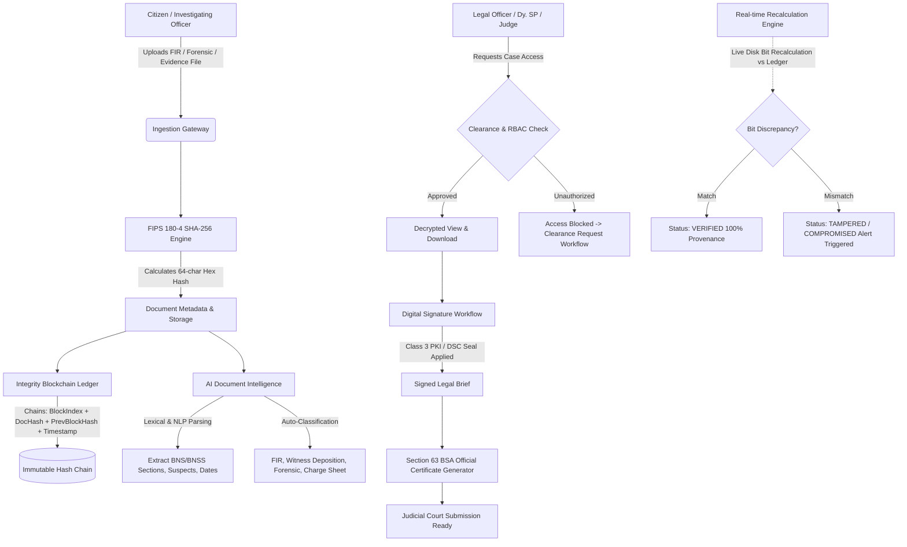

# CASE VAULT: NCRB Secure Digital Document Management System (SIH26190)

**Smart India Hackathon (SIH) 2026**  
**Problem Statement ID:** 26190  
**Problem Statement Title:** Secure Digital Document Management System for Legal and Investigation Documents  
**Theme:** Blockchain & Cybersecurity  
**Category:** Software  
**Team Name:** sameer ai  
**Target Organization:** National Crime Records Bureau (NCRB), Ministry of Home Affairs, Government of India  
**Production Frontend URL:** https://legal-dms-88o3.vercel.app  

---

## 📌 Table of Contents
1. [Executive Overview & Vision](#-executive-overview--vision)
2. [End-to-End System Workflow](#-end-to-end-system-workflow)
3. [Evolution: Previous PPT vs. Current Advanced Implementation](#-evolution-previous-ppt-vs-current-advanced-implementation)
4. [Core Architectural Components](#-core-architectural-components)
5. [Legal Compliance & Statutory Grounding (BSA 2023 / BNSS 2023)](#-legal-compliance--statutory-grounding)
6. [Cybersecurity & Cryptographic Architecture](#-cybersecurity--cryptographic-architecture)
7. [AI Document Intelligence Engine](#-ai-document-intelligence-engine)
8. [Role-Based Access Control (RBAC) & Clearances](#-role-based-access-control-rbac--clearances)
9. [Comprehensive Research & References](#-comprehensive-research--references)
10. [Quick Start & Deployment Guide](#-quick-start--deployment-guide)
11. [REST API Directory](#-rest-api-directory)
12. [Hackathon Demo & Evaluation Guide](#-hackathon-demo--evaluation-guide)

---

## 🛡️ Executive Overview & Vision

In contemporary law-enforcement and judicial ecosystems, criminal case files—ranging from First Information Reports (FIRs), forensic lab analyses, seizure memos, witness depositions, and charge sheets—face acute vulnerabilities:
- **Evidence Tampering & Bit Alteration:** Inability to mathematically prove that an electronic record was not manipulated post-seizure.
- **Fragmented Custody:** Inconsistent paper trails and disjointed file transfers across Police Stations, Forensic Science Laboratories (FSL), State Directorates of Prosecution, and Magistrate Courts.
- **Unauthorized Data Breaches:** Sensitive informant identities and classified investigation memos leaked due to unsegmented legacy access.
- **Judicial Inadmissibility:** Rejection of digital evidence in courts under strict evidence laws due to absence of verifiable cryptographic hash provenance.

**CASE VAULT** solves this with a **Zero-Trust, Tamper-Evident Digital Evidence Vault** adhering strictly to **Section 63 of the Bharatiya Sakshya Adhiniyam (BSA), 2023** (formerly Section 65B IEA) and **Section 105 of the Bharatiya Nagarik Suraksha Sanhita (BNSS), 2023**.

Every piece of evidence is:
1. Cryptographically fingerprinted at source using **FIPS 180-4 SHA-256**.
2. Anchored into an immutable **Tamper-Evident Blockchain Ledger** linking past and present block states.
3. Protected via **FIDO2 / W3C WebAuthn Biometric Passkeys** and **privacyIDEA Enterprise MFA**.
4. Continuously monitored by a **Real-Time Recalculation Engine** that flags disk bit alterations immediately.
5. Searchable via an **AI Legal Intelligence Engine** extracting BNS/BNSS penal provisions.
6. Exportable with an automated **Section 63 BSA / Form 65B Certificate** for court presentation.

---

## 🔄 End-to-End System Workflow



### Detailed Lifecycle Stages:
1. **Citizen & Law Enforcement Ingestion:**
   - Citizens file verified incident reports and upload photos/audio/documents via the **Citizen Portal**.
   - Investigating Officers (IO) create official case dossiers (`CASE-2026-XXXX`) and upload FIRs and forensic evidence via the **Law Enforcement Portal**.
2. **Cryptographic Fingerprinting:**
   - Raw binary streams are hashed using Node.js `crypto.createHash('sha256')`. The resultant 256-bit hexadecimal string forms the document’s permanent mathematical identity.
3. **Ledger Anchoring (Hash-Chain):**
   - The newly generated hash is encapsulated into an `IntegrityLedger` block along with `previousHash`, `timestamp`, `validatorNode`, and `merkleRoot`. Modifying any prior block breaks the entire chain.
4. **AI Legal Extraction & Categorization:**
   - The AI engine inspects the content, matching statutory sections of the **Bharatiya Nyaya Sanhita (BNS)** (e.g. Sec 74, Sec 103, Sec 318), identifies key people (Complainant, Accused, IO), locations, and assigns automated categorization.
5. **Enforced Zero-Trust Access Control:**
   - High-clearance files (`HIGHLY_CONFIDENTIAL`, `RESTRICTED`) are locked behind case-officer bindings. Unauthorized internal personnel are served a formal access request barrier that requires supervisory clearance by a Dy. SP / Reviewer.
6. **Hardware Biometric Custody & PKI Signatures:**
   - Officers verify actions using **FIDO2 biometric passkeys** (Windows Hello, Touch ID, YubiKey) or **privacyIDEA 2FA OTPs**.
   - Legal officers affix cryptographic Class-3 PKI digital signatures to documents, creating binding chain-of-custody timestamps.
7. **Continuous Tamper Recalculation:**
   - Whenever an auditor, judge, or officer audits a file, the system re-reads the underlying file from disk, computes a fresh SHA-256 hash, and compares it against both the database and the blockchain ledger block. If a single bit is altered on disk, a high-severity security alert is raised.
8. **Court Certificate Generation:**
   - Generates an official, print-ready **Section 63 Bharatiya Sakshya Adhiniyam (BSA) 2023 Certificate** certifying device serial numbers, hash algorithms, officer credentials, and exact custody timestamps for court admissibility.

---

## 🚀 Evolution: Previous PPT vs. Current Advanced Implementation

| Component / Parameter | Previous PPT Proposal (`sameer ai` / `CASE VAULT`) | Current Advanced Implementation (Production Codebase) | Advancement & Strategic Impact |
| :--- | :--- | :--- | :--- |
| **Frontend Stack** | React, Next.js, TypeScript, Tailwind CSS, Shadcn UI | **React 18, Vite 6, Tailwind CSS 3.4, Lucide Icons, Recharts** | Eliminated heavy Next.js SSR overhead in favor of ultra-responsive client-side state, instant proxying, and cross-platform speed. |
| **Backend Framework** | Java 17/21, Spring Boot, Spring Security, REST APIs | **Node.js 20+, Express.js 4.21, Prisma ORM 6.4, CommonJS** | Drastically simplified async crypto streams; enabled native integration with W3C WebAuthn `@simplewebauthn` and micro-benchmarked hash recalculations. |
| **Database & Storage** | PostgreSQL, MongoDB, AWS S3 / MinIO | **PostgreSQL (Supabase Direct & Pooled) / SQLite, Local & Cloud Object Storage** | Hybrid dual-readiness: can run locally in isolated offline police stations (SQLite) or enterprise nationwide cloud (Supabase PostgreSQL). |
| **Authentication & IAM** | Keycloak (SSO / RBAC), JWT, OAuth 2.0 | **FIDO2 / WebAuthn Biometric Passkeys, privacyIDEA 3.13+ MFA (SMS OTP/TOTP), JWT, Bcrypt** | Replaced complex heavy Keycloak infrastructure with hardware-backed, phishing-resistant Passkeys (Windows Hello, TouchID) and enterprise privacyIDEA 2FA. |
| **Blockchain / Audit Ledger** | Hyperledger Fabric (Theoretical proposal), IPFS | **Live SHA-256 Hash-Chaining Engine + Hyperledger Fabric v2.5 Architecture Abstraction** | Functioning, real-time blockchain hash-chain ledger with live genesis block, validator node stamping, and chain validation; adapter ready for Fabric chaincode. |
| **Tamper Detection** | Static SHA-256 verification (Check upon upload) | **Dynamic On-Demand File Recalculation Engine** | Reads binary bytes from disk on-the-fly and compares with ledger; catches unauthorized filesystem tamper attacks and flags discrepancy down to the byte. |
| **Legal Compliance** | Mentioned BSA 2023 Section 63 broadly | **Automated Section 63 BSA / Form 65B Statutory Certificate Generator** | Directly generates legally enforceable certificates required under Indian law with device identifiers, SHA-256 hash digests, and certifying officer badges. |
| **AI Intelligence** | Keyword & semantic search concept | **AI Document Intelligence Engine: BNS/BNSS Legal Entity Extraction & Risk Scoring** | Parses new criminal codes (BNS, BNSS, IT Act), performs heuristic categorization, extracts suspects/dates, and calculates real-time 0–100 threat risk scores. |
| **Citizen Engagement** | Not planned (Police & Court internal only) | **Dedicated Citizen & Victim Incident Portal** | Allows citizens to submit complaints, attach cryptographically protected evidence, and track real-time investigation stages securely. |
| **Security Operations** | Basic RBAC permissions | **Dedicated Security Center & Anomaly Detection** | Real-time brute-force account lockout, live suspicious download trackers, access violation logs, and 1-click threat mitigation. |

---

## 🏛️ Core Architectural Components

### 1. Unified Modular Architecture
```
┌────────────────────────────────────────────────────────┐
│                   Frontend (React 18 + Vite)           │
│   Dashboard  •  Cases  •  Documents  •  CitizenPortal │
│   SecurityCenter  •  IntegrityLedger  •  AI Studio     │
└───────────────────────────┬────────────────────────────┘
                            │ HTTPS / REST / WebAuthn
┌───────────────────────────▼────────────────────────────┐
│              Backend Service (Node.js + Express)       │
│  Controllers: Auth, Passkey, Case, Document, Audit, AI │
│  Middleware:  RoleGuard, RateLimit, AuditLogger, Helmet│
└─────────────┬───────────────────────────┬──────────────┘
              │                           │
┌─────────────▼──────────────┐ ┌──────────▼──────────────┐
│ Cryptographic Services     │ │ Storage & Database      │
│ • SHA-256 Byte Streamer    │ │ • Prisma ORM Client     │
│ • Blockchain Hash Chain    │ │ • Supabase / PostgreSQL │
│ • WebAuthn Cryptography    │ │ • Encrypted File Vault  │
│ • PKI Digital Signer       │ │ • Audit Trail Explorer  │
└────────────────────────────┘ └─────────────────────────┘
```

### 2. Multi-Role RBAC Model
The platform enforces hierarchical, zero-trust role segregation:
- **Chief Super Admin (`ganesh@ncrb-demo.gov`):** Master command access across all nationwide cases, blockchain verification, AI models, and threat center.
- **Super Admin (`admin@ncrb-demo.gov`):** System configuration, user provisioning, security policies, and department management.
- **Investigating Officer (`officer@ncrb-demo.gov`):** Case creation, FIR generation, evidence ingestion, witness depositions, version management.
- **Legal Officer (`legal@ncrb-demo.gov`):** Legal brief evaluation, court filings, digital signature affixing, prosecution evidence packages.
- **Reviewer / Dy. SP (`reviewer@ncrb-demo.gov`):** Supervisory review, triage and approval/rejection of classified document access requests.
- **Compliance Auditor (`auditor@ncrb-demo.gov`):** Full cryptographic chain audits, tamper-detection scans, forensic CSV log exports.
- **Citizen / Complainant:** Public portal for lodging cyber/physical crime evidence, receiving tracking tokens, and verifying digital custody.

---

## ⚖️ Legal Compliance & Statutory Grounding

### 1. Bharatiya Sakshya Adhiniyam (BSA), 2023 — Section 63
In July 2024, India replaced the Indian Evidence Act, 1872 with the **Bharatiya Sakshya Adhiniyam (BSA), 2023**.
- **Section 63 BSA** governs the **Admissibility of Electronic Records** (formerly Section 65B of IEA).
- Unlike legacy Section 65B certificates which often relied on vague declarations, the statutory certificate format under **Section 63 Schedule Part B** explicitly requires:
  1. The specific **hash algorithm used** (listing **SHA-256** as an accepted cryptographic standard).
  2. The **hash value of the digital record** at the time of creation and custody transfer.
  3. The technical specification and custody conditions of the computer system or electronic storage device.
- **CASE VAULT Compliance:**
  The system automates the generation of this exact Certificate under Section 63. Any document can be printed with its official seal, certifying officer badge, SHA-256 fingerprint, device host, and chain block index.

### 2. Bharatiya Nagarik Suraksha Sanhita (BNSS), 2023 — Section 105
- **Section 105 BNSS** mandates the **use of audio-video electronic means** during search and seizure operations, preparation of seizure lists, and signing of memos by witnesses.
- **CASE VAULT Compliance:**
  Digital video/audio recordings collected during search and seizure can be ingested directly into Case Vault. The system stamps each multimedia recording with an irreversible SHA-256 fingerprint and anchors it to the ledger within seconds of capture, preserving pristine chain of custody.

### 3. Transition from IPC to Bharatiya Nyaya Sanhita (BNS), 2023
- All document intelligence models and classification algorithms extract and index both legacy **Indian Penal Code (IPC)** references and the newly enacted **Bharatiya Nyaya Sanhita (BNS)** provisions (e.g. BNS Sec 74/78 for Women’s Safety, BNS Sec 103 for Homicide, BNS Sec 318 for Cheating/Fraud, and IT Act Sec 66C/66D for Cybercrime).

---

## 🔒 Cybersecurity & Cryptographic Architecture

### 1. Tamper-Evident Blockchain Ledger
The hash chain operates without requiring energy-intensive proof-of-work, functioning as a high-throughput permissioned hash-linked ledger:
$$\text{BlockHash}_n = \text{SHA-256}\Big( n \parallel \text{DocHash}_n \parallel \text{BlockHash}_{n-1} \parallel \text{Timestamp} \parallel \text{ValidatorNode} \Big)$$
- **Genesis Block:** Anchored at Block Index 0 with an immutable NCRB root signature.
- **Continuous Invariant Check:** Any attempt by an insider or attacker to alter an uploaded file or update an existing database record invalidates the mathematical invariant:
  $$\text{SHA-256}(\text{DiskBytes}) == \text{Document}.\text{currentHash} == \text{LedgerBlock}.\text{documentHash}$$

### 2. Phishing-Resistant FIDO2 / WebAuthn Biometric Passkeys
- Integrated using `@simplewebauthn/server` and `@simplewebauthn/browser`.
- Protects law enforcement accounts against phishing, session hijacking, and brute-force credential stuffing.
- Supports **Windows Hello (Fingerprint & Facial Recognition)**, **Apple Touch ID / Face ID**, and **FIDO2 Hardware Security Keys (YubiKey)**.

### 3. privacyIDEA 3.13+ Multi-Factor Authentication
- Enterprise-grade two-factor authentication (MFA) supporting **RFC 6238 TOTP** (Google Authenticator, Microsoft Authenticator) and **SMS Challenge-Response Gateways** (Twilio / Fast2SMS).
- Provides an emergency fallback mode ensuring operational continuity in tactical offline field environments.

### 4. Zero-Trust Access Clearance Barrier
- Documents labeled `HIGHLY_CONFIDENTIAL` or `RESTRICTED` enforce strict clearance barriers.
- Access attempts trigger real-time logging; unauthorized users must submit a formal justification that routes to a supervisory queue for dual-custody approval.

---

## 🤖 AI Document Intelligence Engine

1. **Natural Language Smart Search:**
   - Interprets conversational law-enforcement queries such as:
     *"Show witness statements related to extortion in Case 102 submitted in August"*
   - Dynamically parses query tokens, matches case references, resolves date filters, and scores relevance.
2. **Statutory Entity & Penal Code Extractor:**
   - Scans unstructured documents to detect suspects, complainants, locations, dates, and penal sections across **BNS**, **BNSS**, and the **Information Technology Act**.
3. **Automated Document Classifier:**
   - Heuristically categorizes uploaded files into official judicial document categories: *FIR*, *Witness Statement*, *Forensic Report*, *Charge Sheet*, *Court Filing*, and *Medical Legal Case (MLC)*.
4. **Behavioral Anomaly & Threat Detection:**
   - Synthesizes metrics across failed authentications, velocity of document downloads, and unauthorized access attempts into a **System Risk Score (0–100)**.

---

## 📚 Comprehensive Research & References

The architectural, cryptographic, and legal designs of CASE VAULT are grounded in the following official statutes, academic papers, and international technical standards:

### 1. Statutory Legislation & Official Government Documents
1. **Bharatiya Sakshya Adhiniyam (BSA), 2023 (Act No. 47 of 2023):**
   *India Code Legislative Repository, Ministry of Law and Justice.*  
   *Focus:* Section 63 (Admissibility of electronic records and mandatory hash certificate formats).
2. **Bharatiya Nagarik Suraksha Sanhita (BNSS), 2023 (Act No. 46 of 2023):**
   *Ministry of Home Affairs, Government of India.*  
   *Focus:* Section 105 (Mandatory forensic videography of search and seizure operations).
3. **Bharatiya Nyaya Sanhita (BNS), 2023 (Act No. 45 of 2023):**
   *Ministry of Law and Justice, Government of India.*  
   *Focus:* Substantive criminal law taxonomy and section mapping.
4. **Information Technology Act, 2000 (Amended 2008):**
   *Ministry of Electronics and Information Technology (MeitY).*  
   *Focus:* Section 35 (Digital Signature Certificates), Section 43A (Data Protection), Section 66C/66D (Cyber Identity Theft and Impersonation).
5. **National Cyber Security Policy & CERT-In Guidelines:**
   *Indian Computer Emergency Response Team (CERT-In).*  
   *Focus:* Secure log retention, mandatory multi-factor authentication, and incident reporting.

### 2. Cryptographic & Security Standards
6. **NIST FIPS PUB 180-4: Secure Hash Standard (SHS):**
   *National Institute of Standards and Technology (NIST), U.S. Department of Commerce.*  
   *Focus:* Specification of the Secure Hash Algorithm (SHA-256) for irreversible digital signatures.
7. **ISO/IEC 27037:2012:**
   *Information technology — Security techniques — Guidelines for identification, collection, acquisition and preservation of digital evidence.*  
   *Focus:* Principles of Chain of Custody, digital evidence integrity, auditability, and court reproducibility.
8. **W3C Web Authentication (WebAuthn Level 3) / FIDO2 Alliance:**
   *World Wide Web Consortium & FIDO Alliance.*  
   *Focus:* Public-key credential issuance for phishing-resistant hardware biometric authentication.
9. **RFC 6238 & RFC 4226 (IETF):**
   *Internet Engineering Task Force.*  
   *Focus:* Time-Based One-Time Password Algorithm (TOTP) and HMAC-Based One-Time Password Algorithm (HOTP).
10. **privacyIDEA 3.13 Documentation:**
    *NetKnights GmbH.*  
    *Focus:* Multi-factor authentication server architecture, SMS gateway dispatching, and token life-cycle management.

### 3. Distributed Ledger & Enterprise Blockchain Architecture
11. **Hyperledger Fabric v2.5 LTS Documentation:**
    *Linux Foundation & Hyperledger Project.*  
    *Focus:* Permissioned enterprise distributed ledgers, Raft crash fault-tolerant consensus, channel confidentiality, and smart contracts (Chaincode).
12. **NIST Special Publication 800-88 Rev. 1:**
    *Guidelines for Media Sanitization and Digital Custody Verification.*

---

## 💻 Quick Start & Deployment Guide

### Prerequisites
- **Node.js** (v18.0.0 or higher recommended)
- **npm** (v9.0.0 or higher)
- **Git**

### 1. Unified 1-Click Startup (Recommended)
You can start both the backend API server and the frontend client simultaneously with a single command from the project root:
```powershell
node start_all.js
```
- **Backend API:** `http://localhost:5000`
- **Frontend App:** `http://localhost:5173`

---

### 2. Manual Step-by-Step Setup

#### Step A: Backend Initialization
```powershell
cd backend

# 1. Install Node.js dependencies
npm install

# 2. Synchronize database schema (PostgreSQL or SQLite)
npx prisma db push

# 3. Seed demo accounts, cases, and cryptographic ledger blocks
node prisma/seed.js

# 4. Start backend server
npm start
```

#### Step B: Frontend Initialization
```powershell
cd frontend

# 1. Install client dependencies
npm install

# 2. Launch Vite development server
npm run dev
```

---

## 🔑 Demo Access Directory

All demo accounts share the universal password: **`Demo@2026`**  
*(A 1-click **Role Switcher** is also available on the Login screen and navigation bar for instant evaluation!)*

| Role | Officer Name & Persona | Email / ID | Password | Key Permissions & Capabilities |
| :--- | :--- | :--- | :--- | :--- |
| **Chief Super Admin** | **IPS Manoj Kumar Sharma (DG, NCRB)** | `ganesh@ncrb-demo.gov` | `Ganesh@2026` | Master Command: Full case oversight, blockchain audits, threat center, user control |
| **Super Admin** | **IPS Rajiv Ranjan (Joint Director)** | `admin@ncrb-demo.gov` | `Demo@2026` | Full administrative control, system settings, security logs, user provisioning |
| **Investigating Officer** | **Insp. Vikramaditya Chauhan** | `officer@ncrb-demo.gov` | `Demo@2026` | Case creation, FIR ingestion, evidence uploading, version creation |
| **Legal Officer** | **Adv. Meenakshi Sundaram** | `legal@ncrb-demo.gov` | `Demo@2026` | Review legal briefs, apply Class-3 PKI digital signatures, court submissions |
| **Reviewer / Dy. SP** | **Dy. SP Anita Deshmukh, SPS** | `reviewer@ncrb-demo.gov` | `Demo@2026` | Supervisory review, triage and approve/reject classified access requests |
| **Compliance Auditor** | **Shri R. K. Swaminathan (Auditor)** | `auditor@ncrb-demo.gov` | `Demo@2026` | Validate blockchain integrity, verify tamper status, export forensic audit logs |
| **Citizen (Public)** | *Direct Access via Citizen Portal* | *N/A* | N/A | Submit crime reports, attach cryptographically protected evidence, check FIR status |

---

## 🔌 REST API Directory

| Method | Endpoint | Description | Access Tier |
| :--- | :--- | :--- | :--- |
| `POST` | `/api/auth/login` | Email/password authentication returning JWT | Public |
| `POST` | `/api/passkey/login/options` | Request WebAuthn authentication challenge | Public |
| `POST` | `/api/passkey/login/verify` | Verify hardware passkey signature & issue JWT | Public |
| `POST` | `/api/privacyidea/validate/check` | Validate privacyIDEA 2FA OTP code | Authenticated |
| `GET` | `/api/cases` | Retrieve list of cases filtered by user role | Authenticated |
| `POST` | `/api/cases` | Create a new criminal case dossier | Investigating Officer / Admin |
| `GET` | `/api/documents` | Retrieve list of documents with clearance filters | Authenticated |
| `POST` | `/api/documents/upload` | Ingest document, generate SHA-256, anchor block | Investigating Officer / Admin |
| `POST` | `/api/integrity/verify/:id` | Perform live disk recalculation vs ledger block | Authenticated |
| `GET` | `/api/integrity/chain/validate`| Audit entire blockchain hash chain consistency | Auditor / Admin |
| `POST` | `/api/documents/:id/sign` | Affix Class-3 PKI digital signature to document | Legal Officer / Admin |
| `POST` | `/api/access/request` | Submit formal access clearance request | Authenticated |
| `PUT` | `/api/access/review/:id` | Approve or reject clearance request with remarks| Reviewer / Admin |
| `POST` | `/api/ai/search` | Natural language smart search across repository | Authenticated |
| `GET` | `/api/audit/logs` | Query forensic audit logs with filter params | Auditor / Admin |
| `GET` | `/api/audit/export/csv` | Download forensic immutable audit log CSV | Auditor / Admin |
| `GET` | `/api/security/stats` | Retrieve dynamic system risk score (0-100) & events | Super Admin |

---

## 🎯 Hackathon Demo & Evaluation Guide

When presenting to SIH Evaluators and Judges, follow this 5-minute winning demonstration sequence:

1. **The Problem & Compliance Hook (1 min):**
   - Explain the transition from Indian Evidence Act (Sec 65B) to **Bharatiya Sakshya Adhiniyam, 2023 (Section 63)**.
   - Show how traditional cloud drives fail judicial scrutiny because they lack cryptographic hash certification and tamper-evident proof.
2. **Ingestion & Real-time Blockchain Anchoring (1 min):**
   - Log in as **Investigating Officer** (`officer@ncrb-demo.gov`).
   - Upload a new forensic evidence document into an active case.
   - Point out the instant **SHA-256 calculation** and navigate to the **Integrity Ledger** to show the newly minted block connected to the previous block hash.
3. **The Live Tamper-Recalculation Demonstration (1 min):**
   - Click **Verify Integrity** on a document to show the green **`VERIFIED` (Zero Bit Alteration)** status.
   - Explain how CASE VAULT re-reads the raw file bytes on the physical storage device to ensure no database admin, OS user, or malicious script has altered a single bit.
4. **Zero-Trust Clearance & Supervisory Approval (1 min):**
   - Switch to an officer without clearance attempting to view a `RESTRICTED` file.
   - Show the **Access Required** clearance barrier. Submit an access request.
   - Switch to **Reviewer / Dy. SP** (`reviewer@ncrb-demo.gov`), open the **Access Requests** tab, and approve it with official remarks.
5. **Section 63 BSA Official Evidence Certificate & Passkeys (1 min):**
   - Open **Official Evidence Reports / Section 63 BSA Rules**.
   - Generate and preview the statutory certificate complete with hash values, validator details, certifying officer credentials, and print layout.
   - Demonstrate **Biometric Passkey Login** (Windows Hello / Touch ID) on the login portal to showcase modern zero-phishing authentication.

---

## ⚖️ License
Distributed under the GNU General Public License v3.0 (GPL-3.0). See [LICENSE](file:///c:/Users/saiam/Downloads/SIH-main/SIH-main/LICENSE) for full details.
